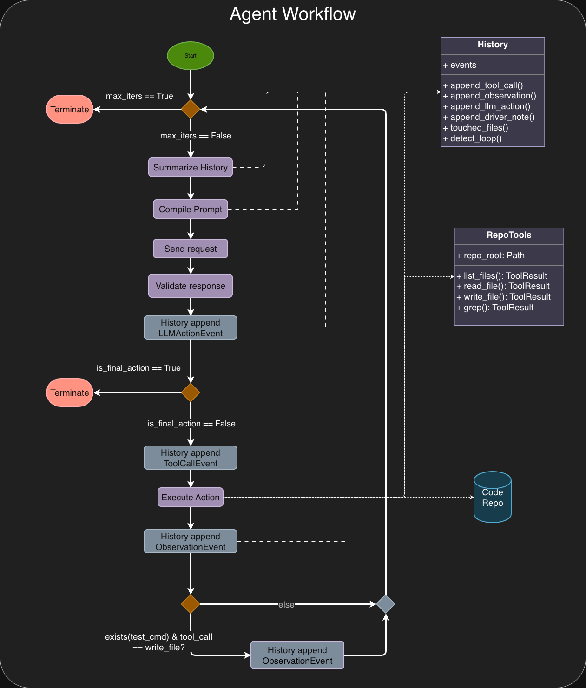
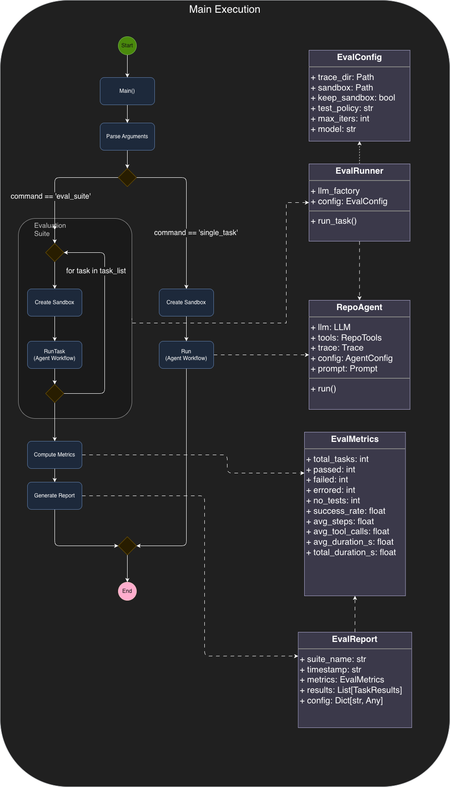

# llm-repo-agent

[Blog post] - https://justinbarry.io/blog/deterministic-llm-agent

A disciplined, loop-based repository fixer powered by LLMs. The model chooses one action at a time, the driver executes safely in a sandbox, runs your test command after writes, and records a full JSONL trace for replay and debugging.

**Core insight:** A coding agent is a stochastic model wrapped in a deterministic scaffold. The scaffold is where engineering lives. This project treats the LLM as a reasoning engine while using deterministic engineering to constrain behavior and enforce predictability.

---

## Table of Contents

- [Features](#features)
- [Installation](#installation)
- [Quickstart](#quickstart)
- [Commands](#commands)
  - [run](#run-single-task)
  - [eval](#eval-evaluation-suite)
- [How It Works](#how-it-works)
- [Architecture](#architecture)
- [Configuration](#configuration)
- [Trace Inspection](#trace-inspection)
- [Extending](#extending)
- [Design Principles](#design-principles)
- [Development](#development)

---


<figure id="fig-agent-workflow">
  
  <figcaption>
    Fig 1: A diagram of the workflow executed by the driver (RepoAgent.run)
  </figcaption>
</figure>

---

<figure id="fig-agent-main-execution">
  
  <figcaption>
    Fig 2: A diagram of the execution from main.
  </figcaption>
</figure>

## Features

- **Constrained Tools:** Only `list_files`, `read_file`, `grep`, `write_file`. No arbitrary shell, no network access. Tests are driver-controlled via `--test`.
- **Typed Actions:** LLM must return `ToolCallAction` or `FinalAction`. Legacy dict-shaped actions are rejected.
- **ReACT + CoT:** LLM produces typed actions with optional `thought` field; driver enforces one action per turn.

- **Evidence Rule:** No final answer until at least one tool has been called—prevents hallucinated responses.
- **Reflection System:** On test failures, tool errors, or loop detection, a second LLM call distills lessons (`notes`, `next_focus`, `risks`) that persist in history.
- **Sandbox Isolation:** Runs against a temporary copy of the repo by default—safe to experiment without touching your original code.
- **Full Observability:** Everything logged to JSONL: prompts, tool calls, results, reflections, trailing text warnings, test outputs, finals.
- **Evaluation Harness:** Run suites of tasks, collect metrics, generate reports, compare baselines.

---

## Installation

Requires Python 3.10+.

```bash
# Clone the repo
git clone https://github.com/yourusername/llm-repo-agent.git
cd llm-repo-agent

# Install dependencies
poetry install

# Set your OpenAI API key
export OPENAI_API_KEY="sk-..."

# Optionally set a specific model (default: gpt-4.1-mini)
export OPENAI_MODEL="gpt-4o"
```

---

## Quickstart

### Fix a bug in QuixBugs

```bash
# Quick fix (usually one write): quicksort
poetry run repo-agent run \
  --repo ~/projects/QuixBugs \
  --goal "Fix quicksort so python_testcases/test_quicksort.py passes. Make the smallest correct change." \
  --test "python -m pytest -q python_testcases/test_quicksort.py" \
  --trace runs/trace.jsonl
```

### Harder case (triggers reflection)

```bash
poetry run repo-agent run \
  --repo ~/projects/QuixBugs \
  --goal "Fix breadth_first_search so python_testcases/test_breadth_first_search.py passes." \
  --test "python -m pytest -q python_testcases/test_breadth_first_search.py" \
  --trace runs/trace.jsonl
```

### View help

```bash
poetry run repo-agent --help
poetry run repo-agent run --help
poetry run repo-agent eval --help
```

---

## Commands

### `run`: Single Task

Run the agent on a single repository with a goal.

```bash
poetry run repo-agent run \
  --repo <path>           # Path to target repository
  --goal <string>         # What you want the agent to do
  --test <command>        # Test command (e.g., "python -m pytest -q")
  --llm-provider <name>   # openai | together (default: openai)
  --model <model>         # Override model for the provider
  --together-api-key <k>  # Together API key override (optional)
  --trace <path>          # JSONL trace file (default: runs/trace.jsonl)
  --test-policy <policy>  # on_write | on_final | never (default: on_write)
  --sandbox / --no-sandbox  # Run in sandbox (default: enabled)
  --keep-sandbox          # Keep sandbox directory after run
  --sandbox-dir <path>    # Explicit sandbox directory
```

**Test policies:**
- `on_write` (default): Run tests after each `write_file` call
- `on_final`: Run tests once before returning final answer
- `never`: Skip driver-run tests entirely

### `eval`: Evaluation Suite

Run a suite of tasks for benchmarking and metrics collection.

```bash
poetry run repo-agent eval \
  --suite <path>          # Path to suite JSON file
  --trace-dir <path>      # Directory for trace files (default: runs/eval)
  --report <path>         # Output report JSON (default: runs/eval/report.json)
  --test-policy <policy>  # on_write | on_final | never
  --max-iters <n>         # Max agent iterations per task (default: 20)
  --model <model>         # Override OPENAI_MODEL env var
  --llm-provider <name>   # openai | together (default: openai)
  --together-api-key <k>  # Together API key override (optional)
  --quiet                 # Suppress per-task progress output
```

**Suite JSON format:**

```json
{
  "name": "my_suite",
  "description": "Bug fixes for sorting algorithms",
  "defaults": {
    "repo": "~/projects/QuixBugs",
    "test_cmd": "python -m pytest -q"
  },
  "tasks": [
    {
      "task_id": "fix_quicksort",
      "goal": "Fix quicksort so tests pass",
      "test_cmd": "python -m pytest -q python_testcases/test_quicksort.py",
      "metadata": {"difficulty": "easy", "category": "sorting"}
    },
    {
      "task_id": "fix_mergesort",
      "goal": "Fix mergesort so tests pass",
      "test_cmd": "python -m pytest -q python_testcases/test_mergesort.py",
      "metadata": {"difficulty": "medium", "category": "sorting"}
    }
  ]
}
```

**Output:**
- Per-task trace JSONL files in `--trace-dir`
- Aggregate `report.json` with metrics (success rate, avg steps, duration)
- Console summary with pass/fail breakdown by category

---

## How It Works

```
┌─────────────────────────────────────────────────────────────────┐
│                         DRIVER LOOP                             │
│  ┌──────────┐    ┌──────────┐    ┌──────────┐    ┌──────────┐  │
│  │  Prompt  │───▶│   LLM    │───▶│  Parse   │───▶│ Execute  │  │
│  │ Compiler │    │  Call    │    │  Action  │    │  Tool    │  │
│  └──────────┘    └──────────┘    └──────────┘    └──────────┘  │
│       ▲                                               │         │
│       │         ┌──────────────────────────────┐      │         │
│       │         │     Reflection Controller    │◀─────┤         │
│       │         │  (on failure/loop/error)     │      │         │
│       │         └──────────────────────────────┘      │         │
│       │                                               ▼         │
│  ┌──────────┐                                   ┌──────────┐   │
│  │ History  │◀──────────────────────────────────│  Tests   │   │
│  │  + State │                                   │ (if any) │   │
│  └──────────┘                                   └──────────┘   │
└─────────────────────────────────────────────────────────────────┘
                              │
                              ▼
                    ┌──────────────────┐
                    │   JSONL Trace    │
                    │  (full audit)    │
                    └──────────────────┘
```

**Step by step:**

1. **Prompt Compilation:** System rules + goal + compact history + run summary
2. **LLM Call:** Model returns exactly one typed action (`ToolCallAction` or `FinalAction`)
3. **Action Parsing:** Strict validation; common mistakes coerced (e.g., tool name in `type` field)
4. **Tool Execution:** `ActionController` dispatches to `RepoTools` with path safety checks
5. **Test Execution:** If `write_file` and `--test-policy on_write`, driver runs tests
6. **Reflection:** On failures, errors, or loop detection, a second LLM call generates durable lessons
7. **Loop:** Continue until `FinalAction` or max iterations reached
8. **Final Output:** Includes summary, changes list, and test results

---

## Architecture

```
src/llm_repo_agent/
├── main.py                 # CLI entry point (run, eval subcommands)
├── agent.py                # RepoAgent driver loop
├── actions.py              # ToolCallAction, FinalAction, parse_action()
├── tools.py                # RepoTools (list_files, read_file, grep, write_file)
├── controller.py           # ActionController (dispatches actions to tools)
├── prompts.py              # System/user prompt construction
├── llm.py                  # ChatCompletionsLLM adapter (unified multi-turn for all providers)
├── history.py              # Append-only event ledger
├── summary.py              # RunSummary (compact state for prompts)
├── trace.py                # JSONL trace logging
├── sandbox.py              # Sandbox creation/cleanup
├── reflection.py           # Reflection dataclass and prompts
├── reflection_controller.py # Reflection gating and invocation
├── tool_schema.py          # Tool specifications for prompts
├── inspect_trace.py        # Trace inspection CLI utility
└── eval/                   # Evaluation harness
    ├── tasks.py            # TaskSpec, EvalSuite, load_suite()
    ├── runner.py           # EvalRunner, TaskResult
    ├── metrics.py          # compute_metrics(), EvalMetrics
    └── report.py           # Report generation and comparison
```

### Key Components

**RepoAgent** (`agent.py`): The central orchestrator. Enforces invariants:
- Typed action contracts (only `ToolCallAction` or `FinalAction`)
- No final before observations exist (evidence rule)
- Tool allowlisting
- Driver-controlled test execution
- Gated reflection triggers
- Bounded iterations (default: 20)

**RepoTools** (`tools.py`): Intentionally constrained. No arbitrary shell execution—only:
- `list_files(rel_dir, max_files)` — Browse repo structure
- `read_file(rel_path, max_chars)` — Inspect code (truncated)
- `grep(pattern, rel_dir, max_hits)` — Search for patterns
- `write_file(rel_path, content)` — Modify files

All paths validated via `_safe_path()` to prevent directory traversal.

**History & Summary** (`history.py`, `summary.py`): History is an append-only ledger. Summary derives a compact snapshot (files touched, last test result, files with errors) to keep prompts stable and bounded.

**Reflection System** (`reflection.py`, `reflection_controller.py`): When failures occur, a second LLM call generates:
- `notes`: 1-5 actionable lessons from the failure
- `next_focus`: Single most important next probe/fix
- `risks`: Pitfalls to avoid

Reflections are gated (max 5 per run) and deduplicated to avoid noise.

**Trace** (`trace.py`): Complete JSONL audit log capturing:
- `run_start`, `run_end`: Lifecycle events
- `llm_request`: Full prompt sent to model
- `llm_action`: Parsed action (raw + typed)
- `llm_parse_error`: Parse failures
- `tool_result`: Tool execution outcomes
- `tests`: Test command results
- `reflection`: Model's reflection notes
- `driver_note`: Internal notes (loop detection, etc.)

---

## Configuration

### Environment Variables

| Variable | Default | Description |
|----------|---------|-------------|
| `OPENAI_API_KEY` | (required) | Your OpenAI API key |
| `OPENAI_MODEL` | `gpt-4.1-mini` | Model to use for agent calls |

### Agent Configuration

In code (`AgentConfig` in `agent.py`):

| Parameter | Default | Description |
|-----------|---------|-------------|
| `max_iters` | 20 | Maximum agent iterations |
| `max_history` | 12 | Events to include in prompt |
| `loop_tripwire` | 3 | Repeated actions before loop detection |
| `test_policy` | `on_write` | When to run tests |

### Reflection Configuration

In code (`ReflectionConfig` in `reflection_controller.py`):

| Parameter | Default | Description |
|-----------|---------|-------------|
| `enable` | True | Enable reflection system |
| `max_reflections` | 5 | Max reflections per run |
| `reflection_dedup_window` | 5 | Window for duplicate detection |
| `reflect_on_success` | False | Reflect on successes too |
| `reflection_history_window` | 8 | Events to include in reflection prompt |

---

## Trace Inspection

The trace contains everything needed to debug and replay runs.

```bash
# List all runs in a trace file
poetry run python -m llm_repo_agent.inspect_trace --trace runs/trace.jsonl

# View all events for a specific run
poetry run python -m llm_repo_agent.inspect_trace \
  --trace runs/trace.jsonl \
  --run <run_id> \
  --full

# Filter by event kind
poetry run python -m llm_repo_agent.inspect_trace \
  --trace runs/trace.jsonl \
  --run <run_id> \
  --kind reflection \
  --full

# View a specific LLM prompt (pretty-printed)
poetry run python -m llm_repo_agent.inspect_trace \
  --trace runs/trace.jsonl \
  --run <run_id> \
  --kind llm_request \
  --index 0 \
  --pretty-only-prompt
```

**Event kinds:** `run_start`, `run_end`, `llm_request`, `llm_action`, `llm_parse_error`, `llm_trailing_text`, `tool_result`, `tests`, `reflection`, `reflection_request`, `driver_note`, `final`

---

## Extending

### Custom LLM Adapter

Implement the `LLM` protocol with these methods:

```python
from llm_repo_agent.actions import ToolCallAction, FinalAction
from llm_repo_agent.reflection import Reflection

class MyLLMAdapter:
    def next_action(self, messages: List[Dict]) -> ToolCallAction | FinalAction:
        """Return a typed action from the LLM response."""
        # Call your model, parse response, return typed action
        ...

    def reflect(self, messages: List[Dict]) -> Reflection:
        """Return a Reflection from the LLM response (JSON mode)."""
        ...

    # Optional: set these for trace logging
    _last_raw: Any = None       # Raw parsed JSON from response
    _last_trailing: str = ""    # Any trailing text after JSON
```

**Action contracts:**
- `ToolCallAction(name: str, args: dict, thought: Optional[str])`
- `FinalAction(summary: str, changes: list, thought: Optional[str])`

The adapter MUST return typed Action objects. Raw dict-shaped actions are rejected by the driver.

### Adding New Tools

1. Add method to `RepoTools` in `tools.py`
2. Add tool spec to `PROMPT_TOOL_SPEC` in `tool_schema.py`
3. Add dispatch case in `ActionController.execute_action()` in `controller.py`
4. Update `TOOL_NAMES` in `tool_schema.py`

---

## Design Principles

This project embodies several key design choices:

1. **Explicit Boundaries:** The LLM is treated as an untrusted reasoning engine. All outputs are validated and typed.

2. **Enforceable Invariants:** The driver enforces rules the model cannot bypass:
   - One action per turn
   - No final without evidence
   - Bounded iterations
   - Path safety checks

3. **Observability Over Convenience:** Every prompt, response, and tool call is logged. Debugging is first-class.

4. **Constrained Capabilities:** No arbitrary shell, no network. Smaller attack surface, fewer failure modes.

5. **Reflection as Learning:** The model learns from failures mid-run, not just across training. Durable notes persist in history.

6. **Sandbox by Default:** Safe to experiment. Original repo is never touched unless explicitly disabled.

7. **Separation of Concerns:**
   - History: append-only truth
   - Summary: derived compact state
   - Trace: human-facing audit log

---

## Development

### Running Tests

```bash
poetry run pytest
```

### Project Structure

```
llm-repo-agent/
├── src/llm_repo_agent/     # Main package
├── tests/                   # Test suite
├── runs/                    # Default trace output directory
├── eval/suites/             # Example evaluation suites
├── pyproject.toml           # Dependencies and project config
└── README.md
```

### Contributing

1. Fork the repository
2. Create a feature branch
3. Make your changes with tests
4. Ensure `poetry run pytest` passes
5. Submit a pull request

---

## Roadmap

Future enhancements planned (see `blog_post/refactor_notes/changes_for_dpo.md`):

- **Repo-level RAG:** Semantic search via `search_repo` tool with chunking and embeddings
- **Evaluation Harness:** *(Implemented)* Suite runner with metrics and reporting
- **Preference Data Generation:** Multiple rollouts per task, scored by test outcomes
- **DPO Training Pipeline:** Generate training data from (chosen, rejected) pairs
- **Local Model Support:** `HFLocalLLM` adapter for fine-tuned models

---

## License

MIT

---

## Author

Justin Barry ([@justinbarry](https://github.com/justinbarry))

Blog post: [Deterministic LLM Agent](https://justinbarry.io/blog/deterministic-llm-agent)

### Common run commands
poetry run repo-agent eval \
  --suite eval/suites/my_suite.json \
  --trace-dir runs/my_eval_2 \
  --report runs/my_eval_2/report.json \
  --llm-provider openai \
  --model gpt-4.1-mini
