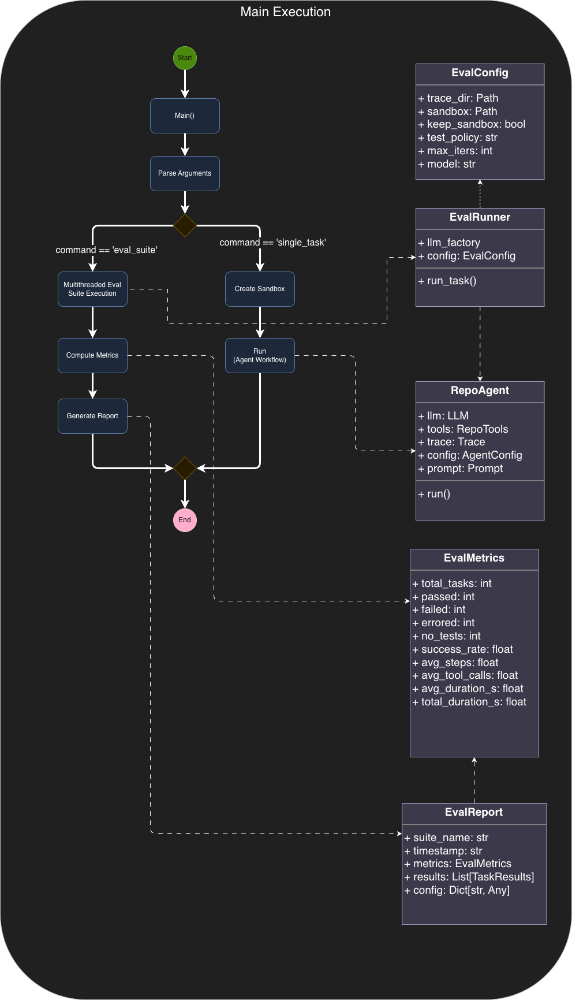
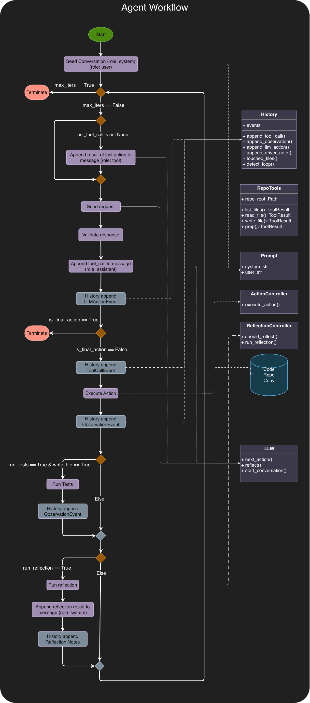
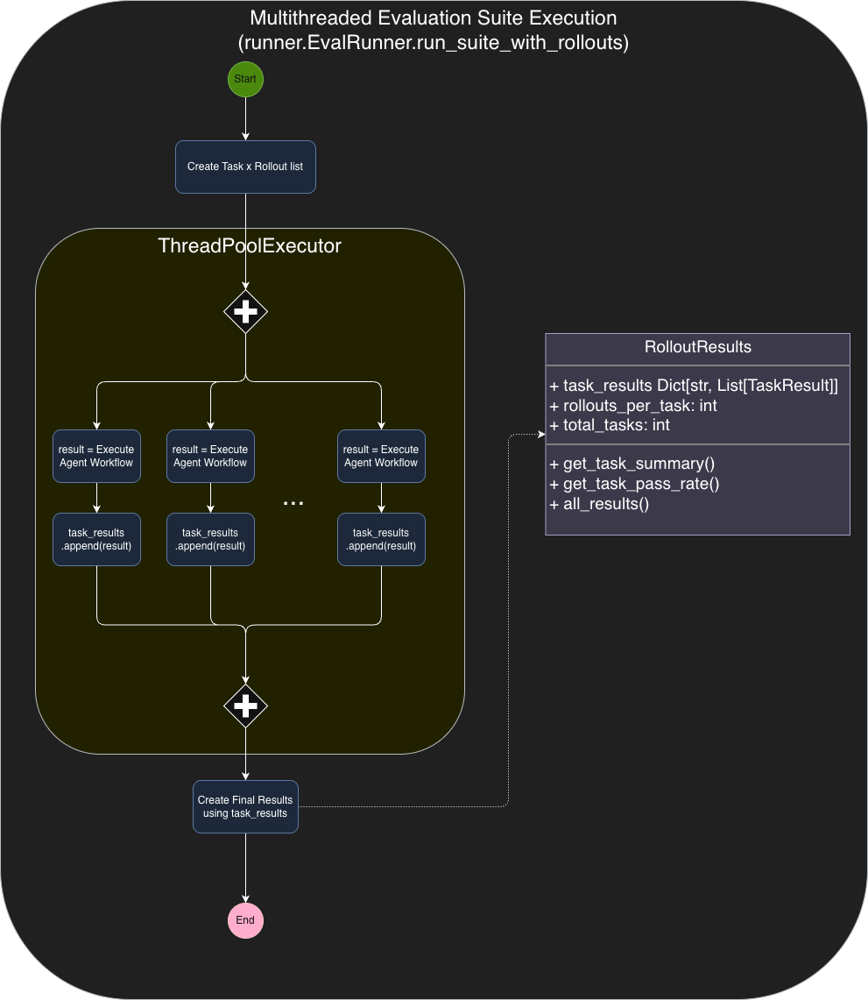

### LLM Repo Agent V2 — What changed since V1 (filled outline)

#### 1) New LLM adapters: Chat Completions + Together

* **What changed**

  * Added a new provider adapter that talks to models through a **Chat Completions**-style API.
  * Added a **Together** adapter so the agent can run inference and fine-tuning workflows on Together-hosted models.
* **Why it changed**

  * V1’s provider wiring made it harder to standardize message formatting, tool-call handling, and multi-turn behavior across models.
  * Moving to a single “Chat Completions” abstraction makes the rest of the agent loop (tools, reflection, parsing, tracing) more uniform.

<figure id="fig-main-execution">
  
  <figcaption>
    Fig 1: A diagram of the main execution. 
  </figcaption>
</figure>

#### 2) Tool protocol refactor: native tool calling → JSON tool calling

* **What changed**

  * Introduced `tool_protocol=json`: instead of relying on native function/tool calling, the model outputs **explicit JSON describing the tool call**.
  * Kept `tool_protocol=native` as an option, but added the JSON mode as a first-class protocol.
* **Why it changed**

  * Fine-tuning workflows (Together SFT/DPO) require training samples where the tool call is explicit in the assistant output—JSON is the cleanest portable representation.
  * JSON tool calls also make parsing, dataset creation, and debugging easier because the tool invocation is visible and auditable.

<figure id="fig-agent-workflow-v2">
  
  <figcaption>
    Fig 1: A diagram of version 2 the workflow executed by the driver (RepoAgent.run)
  </figcaption>
</figure>

#### 3) Response API → Chat Completions multiturn (and removing the history table)

* **What changed**

  * Migrated from a Response-style API approach to **multi-turn Chat Completions**.
  * Removed the separate “history table” concept—conversation state is now represented directly as **messages** (system/user/assistant/tool).
* **Why it changed**

  * The explicit message list is easier to reason about, replay, and fine-tune on.
  * It reduces statefulness and “hidden coupling” in the agent: the prompt you see is the prompt the model sees.

#### 4) Prompt + driver hardening (protocol + invariants)

* **Files touched**

  * `src/llm_repo_agent/prompts.py`
  * `src/llm_repo_agent/agent.py`
  * `tests/test_driver_note_ordering.py`
* **What changed**

  * Made the system prompt explicitly **tool-protocol aware** (different instructions for native vs JSON tool calls).
  * Added a **FIRST ACTION** invariant: require `list_files(rel_dir='.', ...)` before any other tool call.
  * Added a **WRITE RULE** invariant: only `write_file` modifies the repo; the final `changes` field is descriptive only.
  * Ensured reflection / driver notes are appended as `system` messages without breaking the strict adjacency rule:

    * `assistant(tool_call)` → `tool(result)` must remain contiguous.
* **Why it changed**

  * These invariants reduce agent thrash, prevent “fake edits,” and stop subtle message-order bugs that break tool execution.

#### 5) Sandbox added

* **What changed**

  * Added a sandbox layer for running repo operations in a controlled environment.
* **Why it changed**

  * Isolates execution, reduces risk of unintended filesystem damage, and makes runs more reproducible (especially under evaluation).

#### 6) Multithreading added

* **What changed**

  * Added multi-threaded execution for workloads that are embarrassingly parallel (evaluation rollouts, data generation, etc.).
* **Why it changed**

  * Significantly improves throughput and lets you run Monte Carlo-style evaluation and dataset generation in reasonable wall-clock time.

<figure id="fig-multithreaded-eval-suite">
  
  <figcaption>
    Fig 1: A diagram of the how multithreading is used to execute the evaluation suite.
  </figcaption>
</figure>

#### 7) Evaluation harness upgrade: multiple rollouts per task

* **What changed**

  * The eval harness can now run **multiple rollouts per task** (Monte Carlo style) and aggregate metrics.
* **Why it changed**

  * Agent performance is high-variance; single runs can mislead. Multiple rollouts expose stability, failure modes, and real expected performance.

#### 8) SFT pipeline built (and iterated)

* **What changed**

  * Implemented an SFT workflow (documented in `@sft_plan_refined.md`):

    * data generation (~1600 samples)
    * fine-tune job kickoff (Together)
    * `sft-extract` command for extracting usable training traces
    * later consolidated into / replaced by the `prefs` command for data handling
* **Why it changed**

  * Goal was to fine-tune a smaller model (Qwen2.5-7B-Instruct) to reliably emit valid JSON tool calls as a cost-reduction strategy.

#### 9) DPO pipeline (honorable mention)

* **What changed**

  * Implemented preference data generation via `prefs`.
  * Added Together DPO fine-tune job kickoff support.
  * Added cost estimation plumbing to understand budget impact before training.
* **Why it changed**

  * DPO was the next step after SFT: optimize tool-choice quality / behavior using preference pairs, with LoRA where available.
